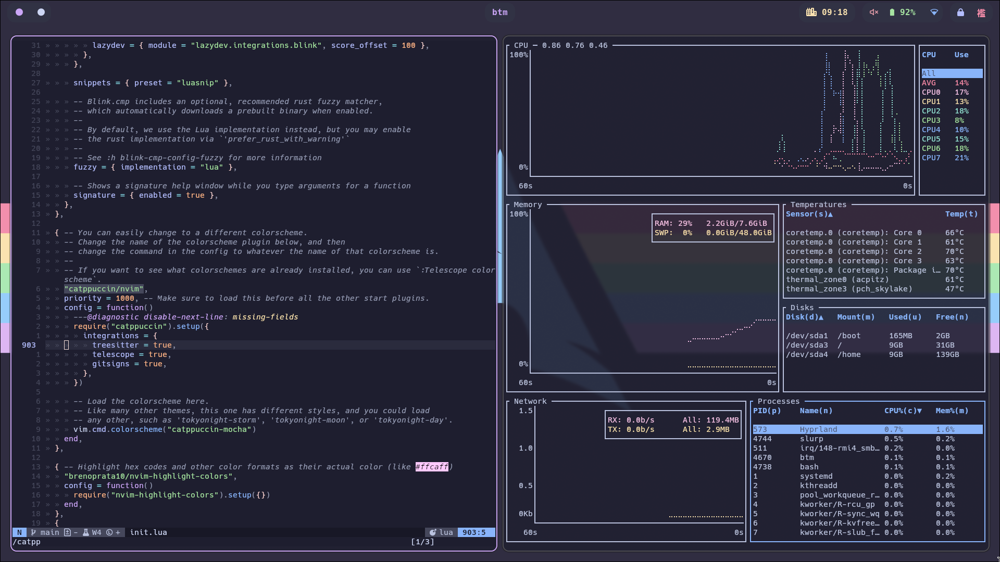
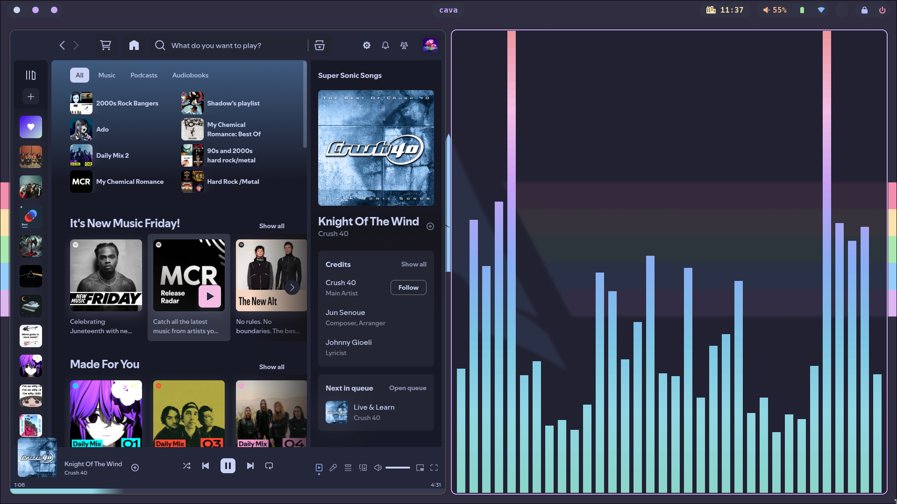

Screenshots

# Description
Honestly 99% of every theme i have is catppuccin macchiato or mocha, so if you want something similar for an app check [the catppuccin page](https://github.com/catppuccin/catppuccin) and yoink the colors from there :3
# Stuff
- Awesomewm
- Better Discord
- Better Lockscreen
- Bottom
- Cava
- Kitty 
- Neofetch
- Neovim
- Nitrogen
- Picom
- Rofi
- Spicetify
- Yazi
- Bat
- Delta
- Glow
- tt (typing test)
- Bash scripts that i use

# Todo
- Seperate rc.lua to be more modular
