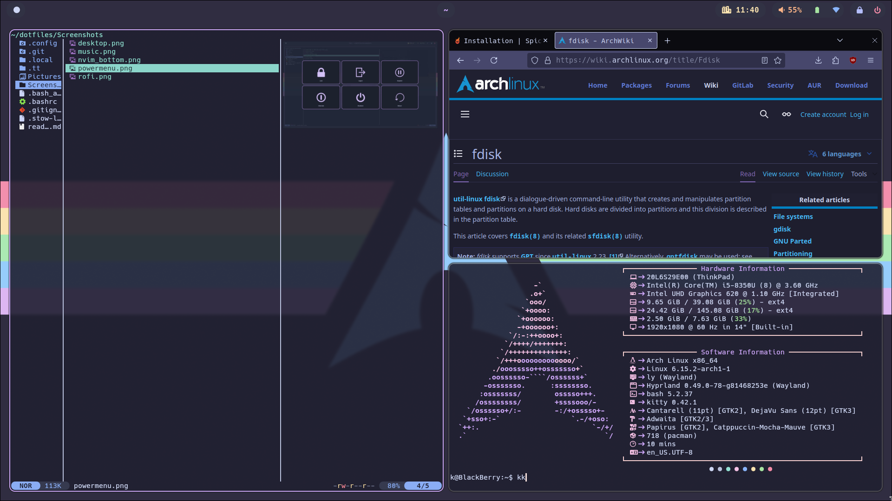
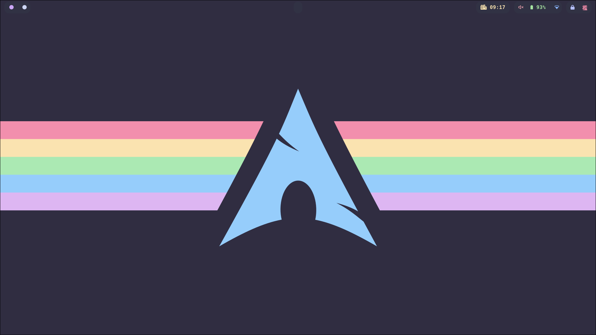

Screenshots

# Description
Honestly 99% of the themes i use are catppuccin mocha or macchiato, so if you want something similar for something, check [the catppuccin page](https://github.com/catppuccin/catppuccin) and yoink the colors from there :3

# Stuff
- Hyprland
- Hyprlock
- Hypridle
- Hyprpaper
- waybar
- wlogout
- mako
- Better Discord
- Bottom
- Cava
- Kitty 
- FastFetch
- Neovim
- Rofi
- Spicetify
- Yazi
- Bat
- Delta
- Glow
- tt (typing test)
- Bash scripts that i use

# Todo
- think of something to put on this list
