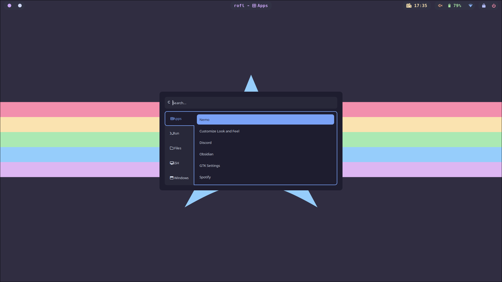

# Screenshots

# Stuff
- Awesomewm
- Better Discord
- Better Lockscreen
- Bottom
- Cava
- Kitty 
- Neofetch
- Neovim
- Nitrogen
- Picom
- Rofi
- Spicetify
- Yazi
- Bat
- Delta
- Glow
- Bash scripts that i use

# Todo
- Seperate rc.lua to be more modular
